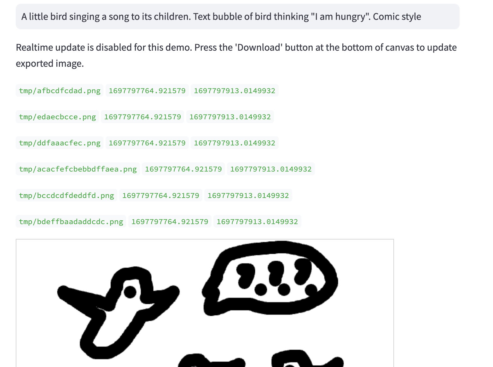
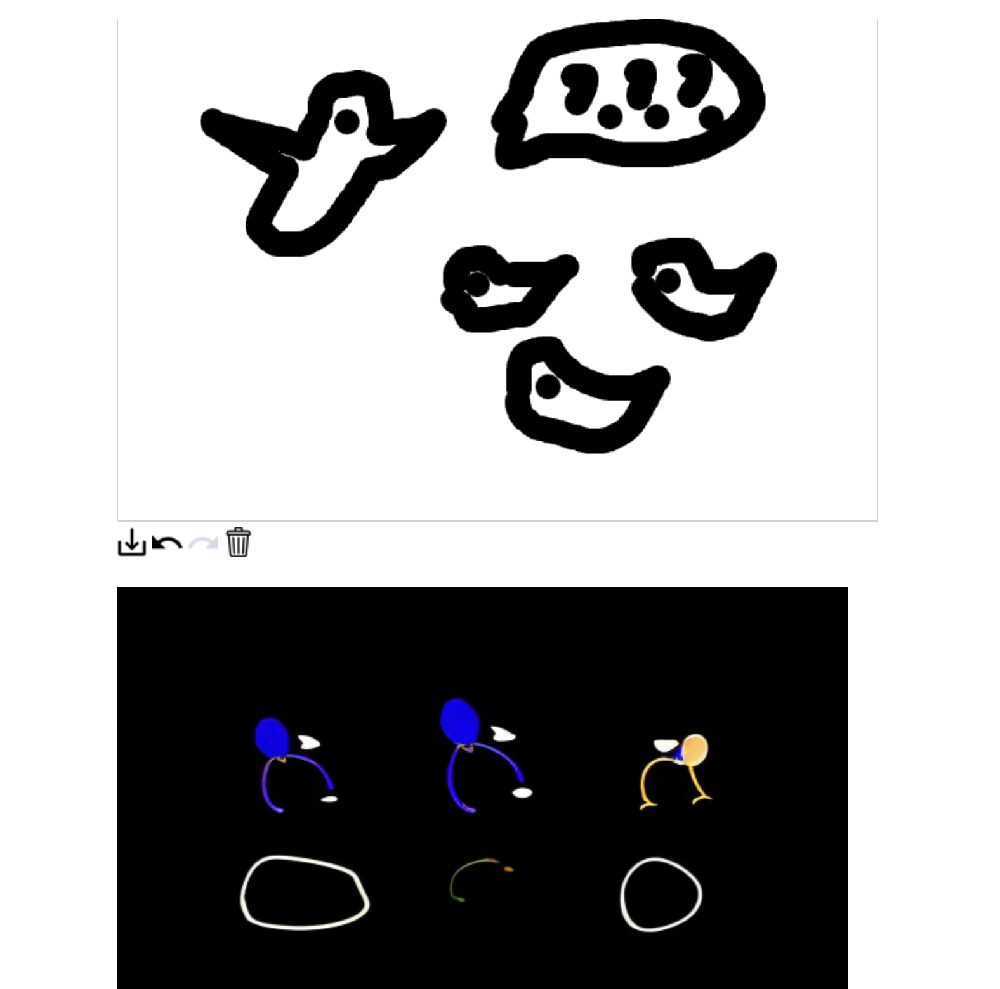
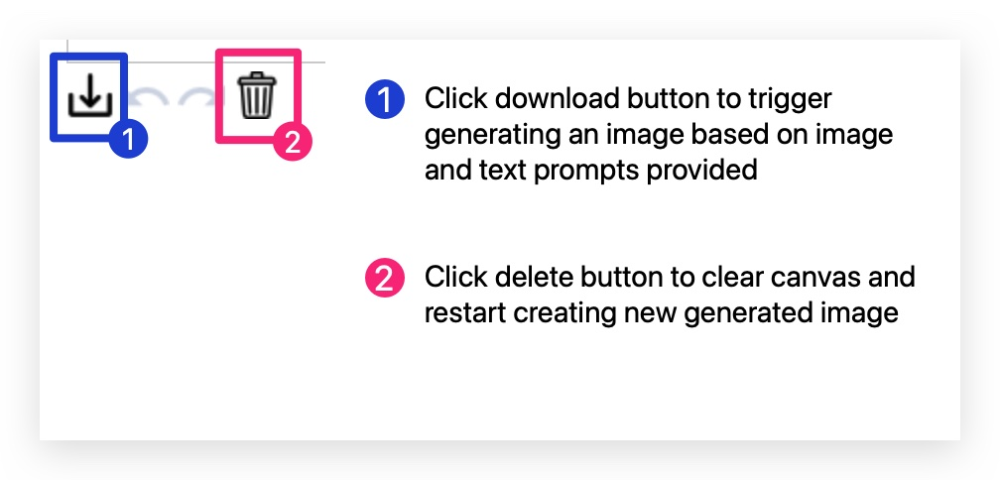

# GenAI for Comics

Work alongside an AI model of your choice to create your favourite visual comics!
Please visit https://friendly-spoon-65oeqxj4lj56emjfnokuay.streamlit.app/ to access the app.

### Considerations

- Using both text and drawing inputs from user to generate a beautiful comic image

### Steps to replicate project locally

1. Type in a text prompt to describe the image you want generated.

2. Draw an image that you want the generated image to be similar to. 

3. Click on download button to trigger generating of image by stable diffusion AI model. The generated image should be visible below the canvas board.

4. Click the delete button to clear canvas and try again

Future improvements:
- Adding more refined drawing tools 
- Experiment with more models to make it more comic looking
- Panel templates for placing generated images

Dependencies:
- streamlit>=0.88
- streamlit-drawable-canvas>=0.8
- svgpathtools
- svgwrite